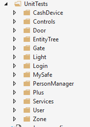
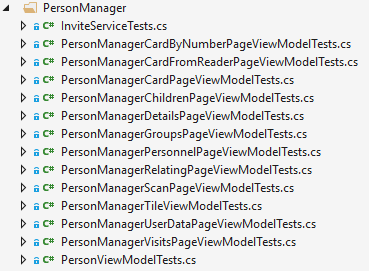
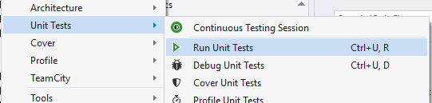
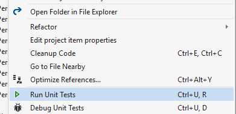
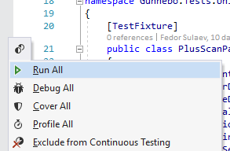

# Unit testing reference

### 1. Goal of writing unit tests
* Designing software components robustly and maintaining high code quality
* Detecting regressions (things that used to work but have unexpectedly stopped working)
* Finding bugs (things that don’t work as you want them to)

### 2. What to test with unit tests

Unit tests should isolate and verify behaviour of a specific small part of functionality of a class independantly of all other parts. Ideally unit test should be validating behaviour of one method of a class and all dependencies of this class should be replaced with mocks. If you can't isolate a method for unit testing, there is a high possibility that something is wrong with architecture or you're trying to write integration test instead of unit test.


### 3. How to add new unit tests

Test classes exist a separate project referencing library under test. Tests project contains UnitTests folder with directories for different modules, add a new folder if you don't see your module/app there. The project can also have additional folders for utility classes (Fakes etc.).



Every class has it's own file for tests, naming scheme is ```[ClassName]Tests```.



To add new unit test for the class add attributes ```[TestFixture]``` for the test class and ```[Test]``` for the test method. Naming convention for unit tests is ```[Unit under test (method name)]_[Condition for the test]_[Expected result]```.
```C#
[TestFixture]
public class ClassNameTests
{
	[Test]
	public async Task MethodName_Condition_Expectation()
	{

	}

	[Test]
	public void MethodName_Condition_Expectation()
	{

	}
}
```

### 4. How to initialize unit tests

Classes under test and mocks for dependencies can be initialized inside unit test method but usually for tests targeting same class most of initialization logic is the same. To simplify initialization for those methods you can use a method with ```[SetUp]``` attribute, this method will be called before each test.
```C#
[SetUp]
public void Init()
{
	_commonDependency = new Mock<IDependencyClass>();
}
```

### 5. How to mock dependencies

Moq library is used to isolate unit under test by replacing dependencies with mocks. All classes in the project use constructor dependency injection and mocks can be passed as constructor arguments when initializing class instance for testing.

```C#
[Test]
public async Task MethodName_Condition_Expectation()
{
	IClassUnderTest service = new ClassUnderTest(_dependency1.Object, _dependency2.Object, _dependency3.Object);
	
	bool result = service.MethodName();

	Assert.That(result, Is.True);
}
```

Sometimes test requires mocked class to return some particular value, here is an example of how this can be done for api request, this api method runs action passed as parameter with specified fake values:
```C#
_heliosApiServiceMock.Setup(h => h.AddNewEntityChild(It.IsAny<string>(), It.IsAny<int>(), It.IsAny<int>(), It.IsAny<Action<ApiResponse<TreeElement>>>())).Callback((string name, int parentId, int typeId, Action<ApiResponse<TreeElement>> action) => action(new ApiResponse<TreeElement> { Response = new TreeElement() })).Returns(Task.FromResult<Object>(null));
```

### 6. How to validate results

Assertions should use new NUnit syntax with ```Assert.That...``` it's readable and intuitive to use:
```C#
int[] array = new int[] { 1, 2, 3 };
Assert.That(array, Has.Exactly(1).EqualTo(3));
Assert.That(array, Has.Exactly(2).GreaterThan(1));
Assert.That(array, Has.Exactly(3).LessThan(100));
```

Sometimes test needs to confirm that some method in a different class was called, not called, called specific number of times or called with specific parameters, this can be done using mock object:
```C#
_heliosApiServiceMock.Verify(h => h.SaveConfigurationForUser(It.IsAny<int>(), It.Is<SaveConfigurationForUserRequest>(s => s.ForCreate.Any(f => f.ApplicationId == 36))), Times.Once);
```

### 7. How to run unit tests from Visual Studio
With ReSharper you can run tests from ReSharper menu, project context menu or run specific file or unit test separately:


If ReSharper is not available you mignt want to install VS extension for NUnit: https://stackoverflow.com/questions/43007761/how-to-run-nunit-tests-in-visual-studio-2017

### 8. How to test methods using Xamarin.Forms libraries
When testing methods calling XF libraries common issue is that test fails with exception saying that Xamarin.Forms was not initialized. To fix this problem the test project contains a mock class for XF initialization it should be used before calling the method under test:
```C#
[Test]
public void Method_Condition_Expectation()
{
	FormsMock.Init();
	Device.BeginInvokeOnMainThread(() => { });
}
```

### 9. How to test method querying SQLite database
To test method containing SQLite requests you can use ```InMemoryDatabaseService``` class, this class implements ```IDatabaseService``` interface and allows to use all SQLite operations in memory without creating a persistent db file. Below is a semple setup for a test db, this code recreates tables and cleans up db before each test:

```
private IDatabaseService _inMemoryDatabaseService;

[SetUp]
public async Task Init()
{
	if (_inMemoryDatabaseService == null)
	{
		_inMemoryDatabaseService = new InMemoryDatabaseService();
		await _inMemoryDatabaseService.InitializeConnection(null, null);
		await _inMemoryDatabaseService.InitializeTables(new[]
		{
			typeof(PersonManagerAppUserEntity),
			typeof(UserEntity),
			typeof(PersonManagerApp),
			typeof(Policy),
			typeof(PossiblePolicyValue)
		});
	}
	await _inMemoryDatabaseService.CleanupCacheTable();
}
```
Testing entity framework: https://msdn.microsoft.com/en-us/library/dn314429%28v=vs.113%29.aspx

### 10. Documentation

NUnit 3 documentation wiki: https://github.com/nunit/docs/wiki/NUnit-Documentation
Moq documentation: https://github.com/Moq/moq4/wiki/Quickstart
